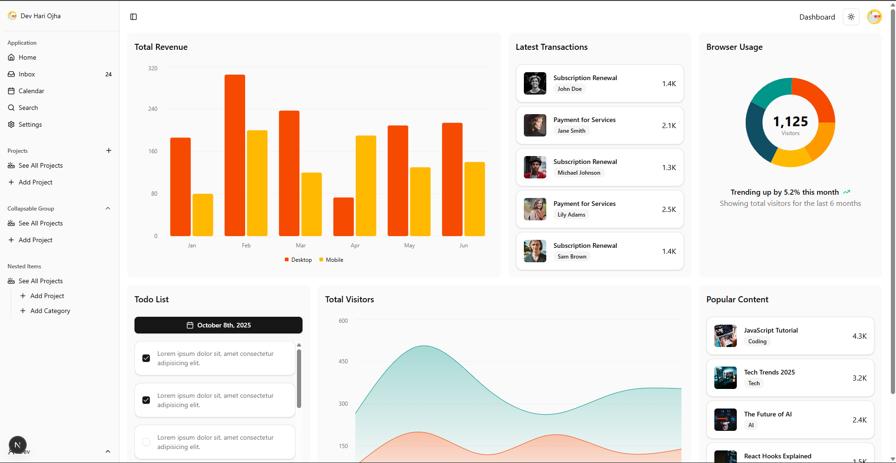

# shadcn/ui Dashboard Project

A modern, responsive dashboard application built with Next.js 15, React 19, and shadcn/ui components. This project demonstrates a complete admin dashboard with user management, payment tracking, data visualization, and a beautiful dark/light theme support.



## ✨ Features

- **🎨 Modern UI Components**: Built with shadcn/ui and Radix UI primitives
- **📊 Data Visualization**: Interactive charts using Recharts (Area, Bar, Line, Pie charts)
- **📋 Data Tables**: Advanced table with sorting, filtering, and pagination using TanStack Table
- **👥 User Management**: User listing and detailed user profiles with edit capabilities
- **💳 Payment Tracking**: Payment data table with column management
- **🌓 Theme Support**: Dark/Light mode toggle with next-themes
- **📱 Responsive Design**: Mobile-friendly sidebar and layouts
- **🎯 Form Handling**: React Hook Form with Zod validation
- **🚀 Performance**: Built on Next.js 15 with Turbopack

## 🛠️ Tech Stack

- **Framework**: [Next.js 15.3.0](https://nextjs.org/)
- **React**: 19.0.0
- **UI Components**: [shadcn/ui](https://ui.shadcn.com/)
- **Styling**: [Tailwind CSS 4](https://tailwindcss.com/)
- **Component Library**: [Radix UI](https://www.radix-ui.com/)
- **Charts**: [Recharts](https://recharts.org/)
- **Table**: [TanStack Table](https://tanstack.com/table)
- **Form Management**: [React Hook Form](https://react-hook-form.com/)
- **Validation**: [Zod](https://zod.dev/)
- **Icons**: [Lucide React](https://lucide.dev/)
- **TypeScript**: Type-safe development

## 📦 Project Structure

```
shadcn/
├── public/               # Static assets
│   ├── logo.svg
│   └── SS.png
├── src/
│   ├── app/             # Next.js App Router pages
│   │   ├── layout.tsx   # Root layout
│   │   ├── page.tsx     # Home page
│   │   ├── payments/    # Payment management pages
│   │   └── users/       # User management pages
│   ├── components/      # React components
│   │   ├── ui/          # shadcn/ui components
│   │   ├── providers/   # Context providers
│   │   ├── AppSidebar.tsx
│   │   ├── Navbar.tsx
│   │   ├── CardList.tsx
│   │   ├── TodoList.tsx
│   │   ├── EditUser.tsx
│   │   └── Chart components (Bar, Line, Area, Pie)
│   ├── hooks/           # Custom React hooks
│   └── lib/             # Utility functions
└── components.json      # shadcn/ui configuration
```

## 🚀 Getting Started

### Prerequisites

- Node.js 20.x or higher
- npm, yarn, or pnpm

### Installation

1. Clone the repository:
```bash
git clone <repository-url>
cd shadcn
```

2. Install dependencies:
```bash
npm install --legacy-peer-deps
# or
pnpm install
# or
yarn install
```

3. Run the development server:
```bash
npm run dev
# or
pnpm dev
# or
yarn dev
```

4. Open [http://localhost:3000](http://localhost:3000) in your browser to see the application.

## 📜 Available Scripts

- `npm run dev` - Start development server with Turbopack
- `npm run build` - Build for production
- `npm run start` - Start production server
- `npm run lint` - Run ESLint

## 🎨 UI Components

This project includes the following shadcn/ui components:

- Avatar
- Badge
- Breadcrumb
- Button
- Calendar
- Card
- Chart
- Checkbox
- Collapsible
- Dropdown Menu
- Form
- Hover Card
- Input
- Label
- Popover
- Progress
- Scroll Area
- Select
- Separator
- Sheet
- Sidebar
- Skeleton
- Table
- Tooltip

## 📱 Pages

### Home Dashboard (`/`)
- Overview cards with key metrics
- Multiple chart visualizations
- Todo list component
- Responsive sidebar navigation

### Users (`/users`)
- User listing and management
- Individual user profiles (`/users/[username]`)
- Edit user functionality

### Payments (`/payments`)
- Payment data table
- Advanced filtering and sorting
- Pagination support

## 🎨 Theming

The application supports both light and dark modes. The theme can be toggled using the theme switcher in the navbar. Theme preferences are persisted across sessions.

## 🔧 Configuration

### Tailwind CSS
Configuration is in `postcss.config.mjs` and uses Tailwind CSS 4 with `@tailwindcss/postcss`.

### shadcn/ui
Component configuration is in `components.json`. You can add more components using:
```bash
npx shadcn@latest add [component-name]
```

### TypeScript
TypeScript configuration is in `tsconfig.json` with strict mode enabled.

## 📝 License

This project is private and not licensed for public use.

## 🤝 Contributing

This is a private project. If you have access and want to contribute:

1. Create a feature branch
2. Make your changes
3. Submit a pull request

## 📧 Contact

For questions or support, please contact the project maintainer.

---

Built with ❤️ using Next.js and shadcn/ui